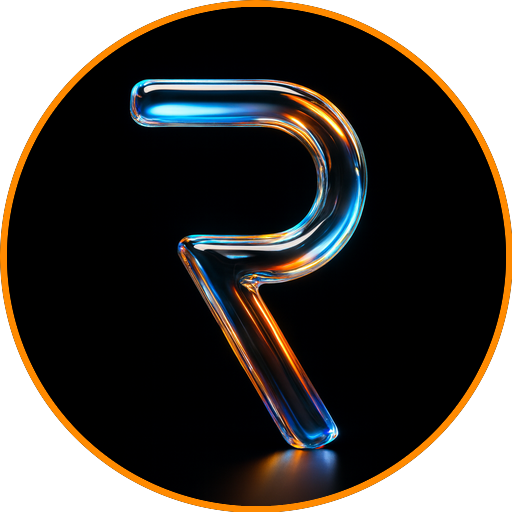

  

---

## 👋 Sobre mí

Soy desarrollador Python y profesional de TI en **Manaus, Brasil** 🌴. Construyo herramientas que resuelven problemas reales: bots, automatizaciones y apps con IA. Trabajo freelance y hablo **español 🇪🇸 y português 🇧🇷**.

| | |
|---|---|
| 🤖 **Bots** | Telegram a medida |
| ⚙️ **Automatización** | Flujos y tareas repetitivas |
| 🧠 **IA** | LLMs, video e imagen generativa |
| 🐧 **Setup** | Fedora + Hyprland, todo desde la terminal |

## 🛠️ Stack

## 📊 Estadísticas

## 📫 Contacto

*🧡 Abierto a proyectos freelance y equipos que quieran construir cosas útiles.*

